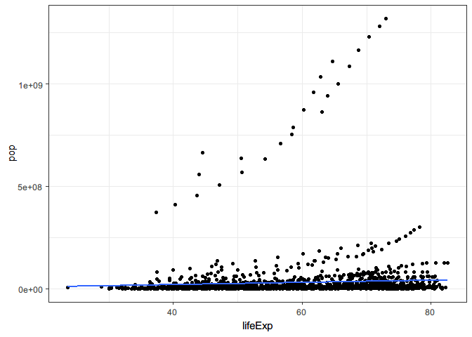
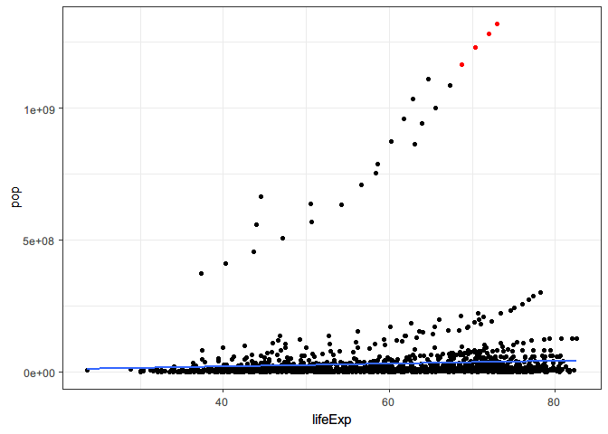
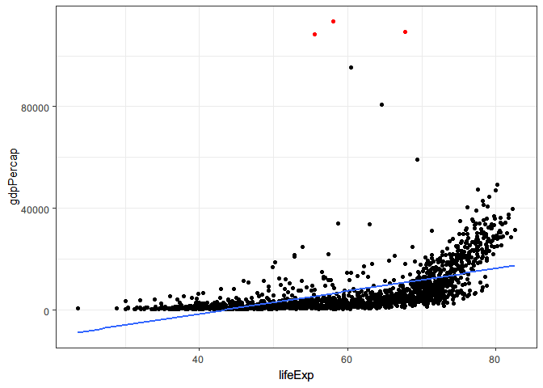

<!-- README.md is generated from README.Rmd. Please edit that file -->

# scatterwithoutlier

<!-- badges: start -->

[](https://www.tidyverse.org/lifecycle/#experimental)
<!-- badges: end -->

The goal of scatterwithoutlier is to create scatterplot for two
quantitative variables with labeled outliers. This function takes a
dataset(as a list, and dataframes/tibbles are lists) of two quantitative
variables and fits a single linear regression model from them, then it
displays a scatterplot with fitted regression line. Also, it displays
any influential points as red color based on user defined criteria
(cut-off for cook’s distance).

## Development Process

usethis or devtools functions applied:

  - create\_package(“scatterwithoutlier”) and use\_git() applied to
    generate the local package.
  - use\_r(“scatterwithoutlier”) generated scatterwithoutlier.R in the R
    folder.
  - use\_testthat() generated the tests folder and associated files.
  - use\_test(“scatterwithoutlier”) generated test-scatterwithoutlier.R
    in tests folder.
  - use\_package(“dplyr”) generated the dependecy on package “dplyr”.
  - use\_pipe() generated the dependecy on package “magrittr”.
  - use\_package(“gapminder”) generated the dependecy on package
    “gapminder”.
  - use\_package(“stats”) generated the dependecy on package “stats”.
  - use\_readme\_rmd() generated README.Rmd.
  - build\_readme() generated README.md from README.Rmd.
  - use\_vignette(“scatterwithoutlier”) generated vignettes.
  - build\_vignettes() built the vignettes.
  - use\_mit\_license(“Tianyi Zheng”) generated LICENSE.md.
  - use\_code\_of\_conduct() generated CODE\_OF\_CONDUCT.md.
  - usethis::use\_pkgdown() and pkgdown::build\_site() generated the
    package website.

Manual works:

  - manually created a project on Github website, and pushed the local
    package into the repo.
  - manually implemented scatterwithoutlier.R and
    test-scatterwithoutlier.R based on Assignment 1.
  - manually filled in information for Readme, and vignettes.
  - manually created and filled in information for NEWS.md

## Installation

`scatterwithoutlier` is not on CRAN yet, so the best way to install it
is:

``` r
# install.packages("devtools")
devtools::install_github("tianyica/scatterwithoutlier")
```

## Example

This is a basic example which shows you how to solve a common problem:

``` r
library(scatterwithoutlier)
## basic example code
```

What is special about using `README.Rmd` instead of just `README.md`?
You can include R chunks like so:

``` r
scatterwithoutlier(gapminder::gapminder %>%
     dplyr::select(lifeExp,pop))
#> `geom_smooth()` using formula 'y ~ x'
```



``` r
scatterwithoutlier(gapminder::gapminder %>%
     dplyr::select(pop,lifeExp),xy=FALSE,cooksd=0.05,verbose = TRUE,outputcount = TRUE)
#> Linear model fitting done, now creating plot...We have 4 influential observations at 0.05 cook's distance threshold
#> `geom_smooth()` using formula 'y ~ x'
```



``` r
scatterwithoutlier(gapminder::gapminder %>%
     dplyr::select(lifeExp,gdpPercap),cooksd = 0.05)
#> `geom_smooth()` using formula 'y ~ x'
```


